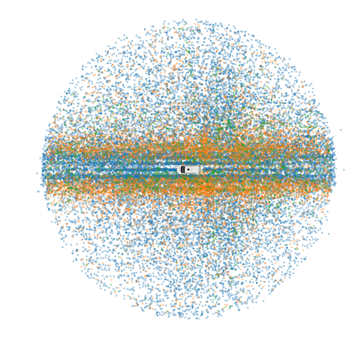
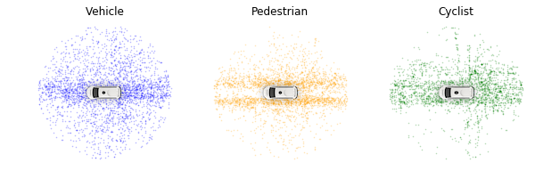

# Exploring the Waymo Open Dataset

## Presentation and Notes

[PDF Version of Presentation Slides](https://drive.google.com/open?id=1YPThwAAlBuYRVPOzDUBFXRnTufu760dC)

[Waymo Open Dataset GitHub](https://github.com/waymo-research/waymo-open-dataset)

[Dataset Tutorial - Colab](https://colab.research.google.com/github/waymo-research/waymo-open-dataset/blob/r1.0/tutorial/tutorial.ipynb)

[Dataset in Google Cloud (Must Request Access)](https://console.cloud.google.com/storage/browser/waymo_open_dataset_v_1_0_0)

## Abstract

[Waymo](link-to-waymo-site) recently released their [Open Dataset](link-to-waymo-dataset). The dataset contains lidar and camera data gathered from Waymo self-driving cars. All segments are pre-labeled with all 3D annotations, and 100 of these segments have additional 2D annotations. 

This work serves to perform a high-level exploratory analysis of the labeled 3D data. Our goal is to better understand the data gathered by the Waymo self-driving cars by analyzing 3D labels and testing three (3) simple hypotheses about object distributions. 

A major focus of this analysis was on visualizing the distribution of object instance and scene attributes. We have also explored the relationship between scene attributes, such as location, weather, and time of day, and the distribution and amount of object instances in each scene. Finally, we examined the position of objects in respect to the Waymo car using the 3D coordinates of each instance bounding box and their headings. 

Ultimately, this work presents and tests three (3) hypotheses based on observations from visualization and analysis of the 3D label data:

1. Vehicle class objects are wider and longer than Pedestrian class objects.

2. The headings Vehicle class objects are more likely to lie either **parallel** or **orthogonal** to the Waymo Car than Pedestrian class objects. 

3. Vehicle class objects are wider and longer than Pedestrian class objects.

## Motivation

After working with the [KITTI benchmark suite](http://www.cvlibs.net/datasets/kitti/) as an undergraduate research assistant, I became interested in the discipline of computer vision and its applications to autonomous vehicles. Waymo's recent release of a large and (relatively) diverse open dataset provides a great opportunity to explore real-world 3D and 2D scenes for autonomous vehicles. 

I wanted to perform this exploratory analysis to better understand the data contained in the Waymo Open Dataset, and to familiarize myself with the datastructures used by Google. I hope to further explore the Waymo dataset at a deeper level, including with future ML and AI projects. 

## Data Collection

The data has been packaged into a total of forty (40) '\*.tar' files, and split into a training and validation set, which contain 32 and 8 files, respectively. The total size of the compressed files is approximately 1TB. 

Each segment is stored in a [TensorFlow Record](https://www.tensorflow.org/tutorials/load_data/tf_records). Within this record are [protocol buffers](https://developers.google.com/protocol-buffers/) for each segment. Protocol buffers seriealize data in a language-agnostic way, but share some similar features to Python dictionaries. 

The files are accessed through a [Google Cloud bucket](link-to-cloud). Given the size of the data, we chose to begin the analysis on a small subset of the data, for a total of 1,000 frames, and then scale.

To collect these frames, we built a scalable pipline to download the compressed files to a virtual machine, unpack the compressed files in a bash script, read the TensorFlow Records in Python, and extract data from the protocol buffers of each frame into a Python dictionary. Each dictionary was then appended to a Pandas DataFrame for easy visualization and manipulation. 

You can access the scripts for the pipeline [here](link-to-scripts-in-github). Before running them you will need to request access to the Waymo Open Dataset storage bucket. A link to the bucket has been provided in the notes.

## Data Analysis

The data was ultimately split into two (2) Pandas DataFrames: The first includes the attributes of each scene (i.e., weather, location, time of day, and object counts). The second DataFrame contains data about each object instance (i.e., the object counts and the location and heading of each instance). 

Below is a sample of each Pandas DataFrame:

Table 1: Five-Row Sample of Scene Attributes DataFrame

|      |   cyclist_count | location    |   pedestrian_count |   sign_count | time_of_day   |   vehicle_count | weather   |   all_object_count |
|-----:|----------------:|:------------|-------------------:|-------------:|:--------------|----------------:|:----------|-------------------:|
|  718 |               5 | location_sf |                 74 |           28 | Day           |              32 | sunny     |                111 |
| 5665 |               0 | location_sf |                  0 |           14 | Day           |              25 | sunny     |                 25 |
|  302 |               0 | location_sf |                 13 |           19 | Day           |              87 | sunny     |                100 |
|  759 |               0 | location_sf |                  1 |           12 | Day           |              30 | sunny     |                 31 |
|  881 |               0 | location_sf |                  0 |           33 | Night         |              33 | sunny     |                 33 |

Table 2: Five-Row Sample of Object Instance DataFrame

|        | category   |   dimension_height |   dimension_length |   dimension_width |    heading |   location_x |   location_y |   location_z |   distance |
|-------:|:-----------|-------------------:|-------------------:|------------------:|-----------:|-------------:|-------------:|-------------:|-----------:|
| 242552 | vehicle    |               1.99 |          4.51771   |          1.91201  |  88.7551   |    30.7989   |    -16.1863  |     1.15742  |   34.7932  |
| 321844 | pedestrian |               1.89 |          1.39697   |          1.0365   | 173.218    |    -9.0511   |      8.4543  |     1.30128  |   12.3854  |
| 348903 | vehicle    |               1.76 |          4.66344   |          2.01356  |   0.676945 |    -0.608897 |     -6.17788 |     0.709428 |    6.20781 |
| 462878 | cyclist    |               1.43 |          1.43591   |          0.777628 | 175.428    |    -2.84022  |     -4.73699 |     0.812319 |    5.52322 |
| 311470 | sign       |               0.61 |          0.0736391 |          0.485803 |  -2.6006   |     0.63274  |     30.1758  |     2.67239  |   30.1824  |

We began our analysis on 1,000 frames and then scaled to a representative sample of 8,000 frames. Within these 8,000 frames were approximately 500,000 object instances. For the purposes of this EDA, it was not necessary to scale our analysis to the entire dataset, and choosing the smaller, representative sample saved time and memory.

### Scene Data

[Jupyter Notebook for Scene Data]()

The scene data we explored includes the attributes of weather, location, time of day, and object counts. We first vizualized the distribution of these attributes over the frames in a histogram.

The majority of the data were gathered in either Pheonix or San Francisco, as shown in Figure 1(b). Likely in large part to location, the weather is nearly always Sunny. Most scenes take place during the day, with only about 25 percent occuring at night or dawn/dusk combined. 

The distribution of the object counts over out sample frames is as follows:

We'll explore individual object instances further, but its important to first to understand how many objects of each class we can expect in a frame. From the histograms above, it appears that we may have many frames with Pedestrian and Cyclist coutns of zero and that vehicle class objects are the most numerous, with a mean somwhere around 30 instances per frame.

Table 1: Mean, Median, and Maximum Count of Instances per Frame for Object Classes

| Object Class | Mean | Median | Max |
|:------------:|:----:|:------:|:---:|
|    Vehicle   |  30  |   27   | 163 |
|  Pedestrian  |  14  |   27   | 192 |
|    Cyclist   |   0  |    0   |  11 |
|      All     |  45  |   33   | 234 |

From the Mean, Median, and Maximum counts of the object class instances, we can see that Cyclist class objects are indeed most rare, with most frames containing no cyclists. Vehicle Class objects also have the highest *average* count, but in at least one frame there are more Pedestrian Class Objects than Vehicles!

As Waymo expands to more cities, it will be intersting to see how the distribution of object instances change; if we went to Denver, would we see more Cyclist Class Objects? If we drove around New York City, could we see an increase in the number of pedestrians? And what would the highest object counts be in the most densly-populated cities?

### Object Instance Data

Each Object instance is categorized by its label class and has attributes of its bounding box dimensions, location in respect to the Waymo Car, and heading in respect to the Waymo Car. We added another column, Distance, which represented the distance of an object instance from the Waymo Car in the X-Y plane. The a sample of the DataFrame containing the object instance data is shown in Table 2.  

To visualize the distribution of object instances by class around the Waymo Car, we plotted individual object instances by their X- and Y-location with a Waymo Car centered at a point (0,0) in the X-Y plane, as shown in Figure 3 below.

This scatter plot contains a total of approximately 38,000 object instances. Of these instances, 25,000 are Vehicle Class objects, 10,000 are Pedestrian Class objects, and 2,629 are Cyclist Class objects. The number of object instances was chosen based on the approximate proportion of each Object Class. 

As we discussed in 'Scene Data,' the Cyclist Class object is a relatively rare occurance, with the majority of frames containing no cyclists. Out of the approximately 500,000 object instances extracted from the 8,000 frame sample, only 2,629 Cyclist Class object instances were labeled. For this reason, *all* cyclist instances have been plotted in Figure 3, unlike Vehicle and Pedestrian Classes which have a small sample displayed in the map.

From the scatter plot, we can begin to percieve trends in the location of object instances. Vehicle and Pedestrian Class objects seem to concentrate along the path of the Waymo Car. To better understand the locations of instances for each class, we plot a sample of approximately 3,000 instances per class in Figure 4.

## Hypothesis Testing

Currently, the in-depth explanation of each Hypothesis Test is contained in the Jupyter Notebooks for Scene Attributes and Object Instances. 
